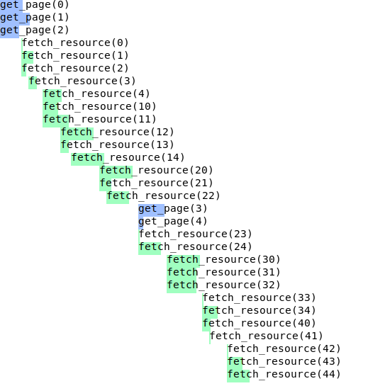

# Rust asynchronous examples

This repository contains examples of `async` programming in Rust, with the [tokio](https://crates.io/crates/tokio) and [futures](https://crates.io/crates/futures) libraries.
They show how to compose [streams](https://docs.rs/futures/0.3.13/futures/stream/trait.Stream.html), in particular buffering and cancellation, to illustrate the following series of blog posts.

- [Asynchronous streams in Rust (part 1) - Futures, buffering and mysterious compilation error messages](https://gendignoux.com/blog/2021/04/01/rust-async-streams-futures-part1.html)
- [Asynchronous streams in Rust (part 2) - Cancelling expired requests](https://gendignoux.com/blog/2021/04/08/rust-async-streams-futures-part2.html)

You can run each example with `cargo run --example <example name>`, and I've tested them with Rust 1.50.0.

```
$ cargo --version
cargo 1.50.0 (f04e7fab7 2021-02-04)
```

Examples files with the `.ok.rs` extension should work, whereas those finishing by `.fail.rs` illustrate some compilation error.

The `plot` example takes the output of other examples and displays a timeline of the asynchronous requests, exported in SVG format.
It is built with the [regex](https://crates.io/crates/regex) and [plotters](https://crates.io/crates/plotters) libraries.


